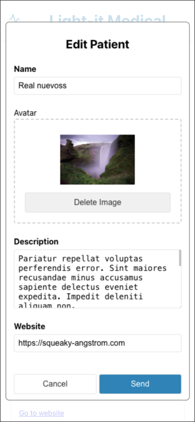

## Features

- React 18 with TypeScript
- Vite for rapid development and optimized builds
- ESLint for code quality
- Hot Module Replacement (HMR)

## Getting Started

### Prerequisites

- Node.js (version 16 or later)
- npm or yarn

### Installation

1. Clone the repository:

   ```
   git clone https://github.com/asuarezaliano/patient-data.git
   cd patient-data
   ```

2. Install dependencies:
   ```
   npm install
   # or
   yarn install
   ```

### Development

To start the development server:

```
npm run dev
# or
yarn dev
```

This will start the app in development mode. Open [http://localhost:5173](http://localhost:5173) to view it in the browser.

## Design Approach

This application was created to manage patient data efficiently. The design approach focuses on performance optimization and maintainability through the use of memoization and component encapsulation.

### Memoization

I used memoization to optimize performance by preventing unnecessary re-renders of components. This is particularly important in a patient management system where the list of patients can grow large. I use memo on PatientCard and PatientList to memoize them so they only change when their props do, and use useCallback when passing a function to a child so it's memoized and doesn't cause a re-render every time. This helped me avoid loading each card every time I added a new patient or opened the modal.

Two key examples of memoization in this project are:

1. The `PatientList` component:

   ```typescript
   const PatientList: React.FC<PatientListProps> = React.memo(({ patients, handleOpenModal }) => {
     // Component logic
   });
   ```

2. The `handleOpenModal` function in the `Patients` component:
   ```typescript
   const handleOpenModal = useCallback((patient?: Patient) => {
     // Function logic
   }, []);
   ```

### Component Encapsulation

The application's structure is designed to encapsulate related functionality within specific components. This approach improves maintainability and reusability. Key examples include:

1. Separate components for `PatientCard`, `PatientList`, and `PatientModal`:
   Each of these components handles a specific aspect of the patient management system, making the code more modular and easier to maintain.

2. Shared components like `Button`, `Input`, and `TextArea`:
   These components encapsulate common UI elements, promoting consistency across the application and reducing code duplication.

3. Layout components:
   Components like `Patients.layout.ts` and `ModalAddPatient.layout.tsx` separate the styling concerns from the main component logic, improving readability and maintainability.

## Tools

This project utilizes the following key technologies:

- React with TypeScript for building the user interface
- Vite as the build tool and development server
- Styled Components for component-based styling
- Axios for making API calls
- Formik with Yup for form management and validation

## UI Views

Here are some screenshots of the application's user interface:


Figure 1: Patient List View


Figure 2: Edit Patient Modal


Figure 3: Mobile Patient List


Figure 4: Mobile Add Patient Modal
